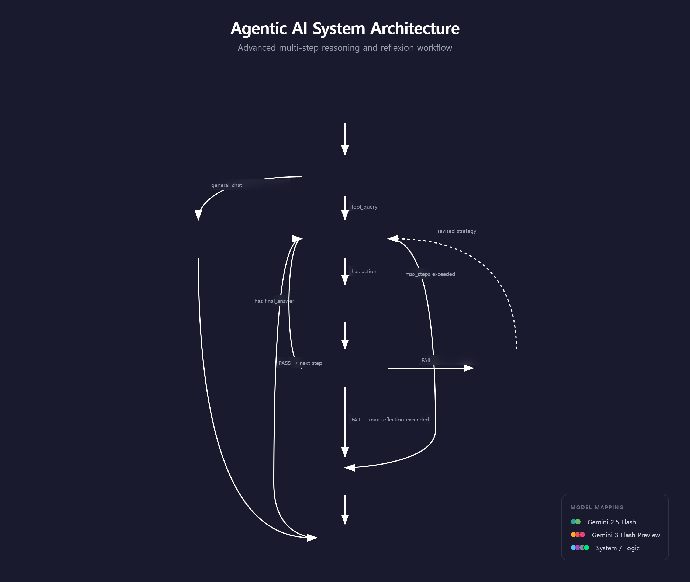
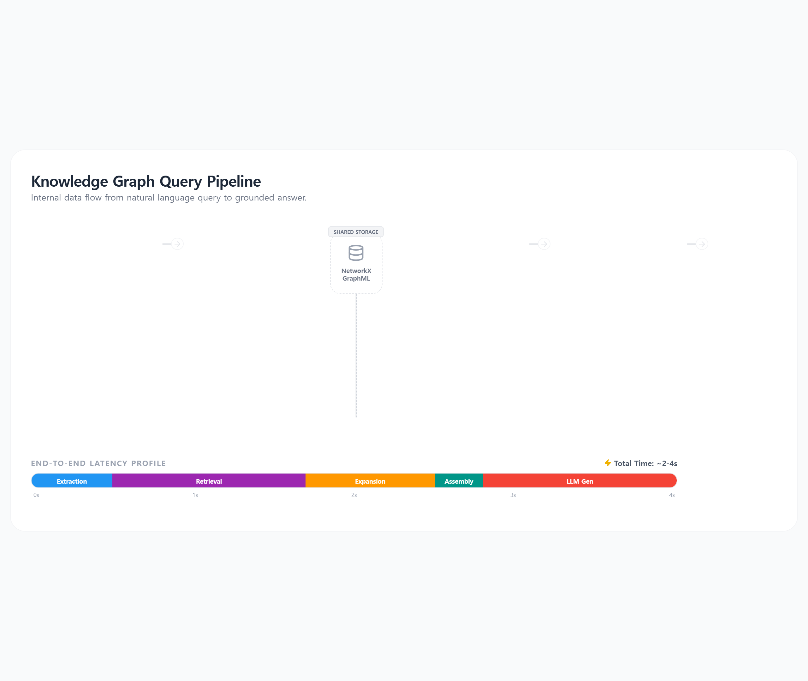

# Agentic AI — Knowledge Graph 기반 ReAct + Reflexion 에이전트

LightRAG(Graph RAG)와 LangGraph를 결합한 **Knowledge Graph 기반 지능형 에이전트** 시스템입니다.
문서를 업로드하면 자동으로 Knowledge Graph를 구축하고, 사용자 질문에 대해 그래프 탐색 + LLM 추론을 결합하여 답변합니다.

---

## 주요 기능

### 에이전트 아키텍처 (ReAct + Reflexion)
- **의도 기반 라우터**: 사용자 질문을 `도구 사용 질의` / `일반 대화`로 자동 분류
- **ReAct 루프**: 추론(Reasoning) → 도구 실행(Action) → 관찰(Observation) 반복
- **Reflexion (자기 반성)**: 답변 품질 평가 후 실패 시 원인 분석 → 전략 수정 → 재시도
- **Exhaustion 처리**: 최대 시도 횟수 초과 시에도 수집된 정보로 최선의 답변 생성

### Knowledge Graph (LightRAG)
- **자동 KG 구축**: 문서 업로드 → 구조화 요약 → 엔티티/관계 추출 → 그래프 생성
- **Hybrid 검색**: Local(엔티티 중심) + Global(관계 중심) 동시 검색 후 교차 병합
- **그래프 확산**: 벡터 검색으로 찾은 노드에서 1-hop 이웃으로 확장하여 관련 정보 확보
- **20종 엔티티 타입**: Person, Organization, Technology, Project, Concept 등

### 도구 (Tools)
| 도구명 | 설명 |
|--------|------|
| `query_knowledge_graph` | KG에서 관련 정보 검색 (hybrid 모드) |
| `list_documents` | 등록된 문서 목록 조회 |
| `get_document_info` | 문서 메타정보 (크기, 수정일, 형식) |
| `get_document_summary` | 문서 구조화 요약 조회 |
| `get_document_content` | 문서 원본 텍스트 조회 |
| `list_document_summaries` | 전체 문서 요약 목록 |
| `get_system_status` | KG 노드/엣지 수, 문서 수 등 시스템 상태 |
| `web_search` | DuckDuckGo + Naver 기반 웹 검색 |

### 문서 처리
- **지원 형식**: `.txt`, `.md`, `.pdf`, `.docx`, `.xlsx`, `.pptx` (6종)
- **하이브리드 요약 파이프라인**: 원본 문서 → 구조화 요약 → LightRAG 인제스트
- **요약 캐시**: `document_summaries.json`에 캐시하여 중복 처리 방지

### 프론트엔드
- **SSE 스트리밍**: 실시간 토큰 단위 답변 스트리밍
- **아코디언 Thinking UI**: 에이전트의 사고 과정을 단계별로 펼쳐 볼 수 있는 UI
- **참고 자료 섹션**: 답변에 사용된 소스/출처를 접을 수 있는 형태로 표시
- **문서 관리**: 사이드바에서 문서 업로드, 목록 조회, KG 인제스트

---

## 기술 스택

| 구성 요소 | 기술 |
|-----------|------|
| 에이전트 프레임워크 | LangGraph (StateGraph) |
| KG 프레임워크 | [LightRAG](https://github.com/HKUDS/LightRAG) |
| 그래프 스토리지 | NetworkX (GraphML) |
| 벡터 스토리지 | LightRAG 자체 JSON 기반 벡터DB |
| 임베딩 모델 | sentence-transformers/all-MiniLM-L6-v2 (384차원, 로컬) |
| LLM (라우팅/직접답변) | Gemini 2.5 Flash |
| LLM (추론/평가/반성) | Gemini 3 Flash Preview |
| 백엔드 | FastAPI + Uvicorn |
| 프론트엔드 | Vanilla JS/CSS (프레임워크 없음) |

---

## 프로젝트 구조

```
agentic_ai/
├── backend/
│   ├── main.py                    # FastAPI 서버 엔트리포인트
│   ├── requirements.txt           # Python 의존성
│   ├── config/
│   │   └── settings.yaml          # 노드별 LLM, 에이전트, 경로 설정
│   ├── prompts/                   # 에이전트 노드별 프롬프트 (XML 태그 구조)
│   │   ├── router.yaml            # 의도 분류 프롬프트
│   │   ├── actor.yaml             # 추론 + 도구 선택 프롬프트
│   │   ├── evaluator.yaml         # 답변 품질 평가 프롬프트
│   │   ├── self_reflection.yaml   # 실패 분석 + 전략 수정 프롬프트
│   │   └── react_agent.yaml       # 직접 답변용 프롬프트
│   └── src/
│       ├── agent/                 # 에이전트 코어
│       │   ├── graph.py           # LangGraph StateGraph 정의
│       │   ├── nodes.py           # 각 노드 로직 (router, actor, evaluator 등)
│       │   ├── router.py          # 의도 분류 라우터
│       │   └── state.py           # AgentState 정의
│       ├── llm/                   # LangChain 모델 설정
│       ├── memory/
│       │   └── lessons_store.py   # 장기 기억 (Reflection 교훈 저장)
│       ├── rag/                   # LightRAG 관련
│       │   ├── lightrag_manager.py    # LightRAG 초기화 + 쿼리 + 인제스트
│       │   ├── document_converter.py  # 6종 포맷 → 텍스트 변환
│       │   ├── document_summarizer.py # LLM 기반 구조화 요약
│       │   └── summary_store.py       # 요약 캐시 관리
│       └── tools/                 # 에이전트 도구
│           ├── lightrag_tools.py  # KG 검색 도구
│           └── utility_tools.py   # 문서/시스템 조회 도구
├── frontend/
│   ├── index.html                 # 메인 페이지
│   ├── app.js                     # 프론트엔드 로직 (SSE, 렌더링)
│   ├── styles.css                 # 스타일시트
│   └── serve.py                   # 캐시 비활성화 정적 서버
├── data/
│   ├── documents/                 # 업로드된 문서 저장 위치
│   └── rag_storage/               # LightRAG 내부 데이터 (자동 생성)
│       ├── graph_chunk_entity_relation.graphml  # 그래프 본체
│       ├── vdb_entities.json      # 엔티티 벡터DB
│       ├── vdb_relationships.json # 관계 벡터DB
│       ├── vdb_chunks.json        # 텍스트 청크 벡터DB
│       └── kv_store_*.json        # 각종 KV 저장소
└── documents/                     # 기술 문서
    ├── knowledge_graph_query_mechanism.md   # KG 쿼리 메커니즘 상세
    └── kg_query_mechanism_explained.md      # KG 쿼리 메커니즘 (쉬운 설명)
```

---

## 에이전트 처리 흐름

<p align="center">
  
</p>

### 노드별 LLM 모델 매핑

| 노드 | 모델 | 색상 | 역할 |
|------|------|------|------|
| Router | Gemini 2.5 Flash | 🟢 Teal | 의도 분류 (tool_query / general_chat) |
| Direct Answer | Gemini 2.5 Flash | 🟢 Green | 일반 대화 응답 |
| Actor | Gemini 3 Flash Preview | 🟠 Orange | 추론 + 도구 선택 |
| Tool Executor | — (LLM 불필요) | 🟣 Purple | 도구 실행 |
| Evaluator | Gemini 3 Flash Preview | 🔴 Red | 기술적 + 논리적 품질 평가 |
| Reflection | Gemini 3 Flash Preview | 🔴 Pink | 실패 분석 + 전략 수정 |
| Exhaustion Answer | Gemini 2.5 Flash | ⚪ Gray | 부분 결과 기반 최선 답변 |

---

## 설치 및 실행

### 1. 환경 설정

```bash
cd backend
python3 -m venv .venv
source .venv/bin/activate
pip install -r requirements.txt
```

### 2. API 키 설정

`backend/` 디렉터리에 `.env` 파일을 생성합니다:

```bash
GOOGLE_API_KEY=your_google_api_key
```

> LightRAG 내부 LLM과 에이전트 노드 모두 Google Gemini를 사용합니다.
> `settings.yaml`에서 노드별 모델을 개별 설정할 수 있습니다.

### 3. 백엔드 서버 실행

```bash
cd backend
source .venv/bin/activate
python main.py
```

서버가 `http://0.0.0.0:8000`에서 시작됩니다.

### 4. 프론트엔드 실행

```bash
cd frontend
python3 serve.py 3000
```

브라우저에서 `http://localhost:3000`으로 접속합니다.

### 5. 문서 인제스트

1. `data/documents/` 폴더에 문서 파일을 넣거나, 프론트엔드에서 업로드
2. 사이드바의 **새로고침** 버튼으로 문서 목록 확인
3. **Ingest Graph** 버튼을 클릭하여 KG 구축
4. 에이전트에게 문서 내용에 대해 질문!

---

## 설정 파일 (settings.yaml)

주요 설정 항목:

```yaml
# 노드별 독립 LLM 구성
llm:
  router:      { model_name: "gemini-2.5-flash", temperature: 0.0 }
  actor:       { model_name: "gemini-3-flash-preview", temperature: 0.7 }
  evaluator:   { model_name: "gemini-3-flash-preview", temperature: 0.0 }
  reflection:  { model_name: "gemini-3-flash-preview", temperature: 0.3 }

# 에이전트 동작 제어
agent:
  max_steps: 5          # ReAct 루프 최대 단계
  max_reflection: 3     # Reflexion 최대 횟수
  enable_streaming: true
```

---

## API 엔드포인트

| Method | 경로 | 설명 |
|--------|------|------|
| POST | `/api/chat` | 일반 채팅 (JSON 응답) |
| POST | `/api/chat/stream` | 스트리밍 채팅 (SSE) |
| GET | `/api/documents` | 문서 목록 조회 |
| POST | `/api/upload` | 문서 업로드 |
| POST | `/api/ingest` | 문서 → KG 인제스트 |

---

## KG 쿼리 파이프라인

<p align="center">
  
</p>

---

## 참고 문서

- [KG 쿼리 메커니즘 상세](documents/knowledge_graph_query_mechanism.md) — 7단계 쿼리 파이프라인, 그래프 확산, 토큰 절단 등 기술 상세
- [KG 쿼리 메커니즘 쉬운 설명](documents/kg_query_mechanism_explained.md) — 비개발자를 위한 도서관/요리 비유 설명

---

## Figma 디자인 원본

Figma AI로 생성한 다이어그램 원본 `.make` 파일:

| 파일 | 내용 | 이미지 |
|------|------|--------|
| `Agentic AI System Flowchart.make` | 에이전트 처리 흐름도 | agent_flowchart.png (2560x2160) |
| `Knowledge Graph Query Pipeline.make` | KG 쿼리 파이프라인 | kg_query_pipeline.png (2560x2160) |

**디코딩 구조** (`.make` = ZIP archive):
```
*.make
├── canvas.fig          # Figma 캔버스 바이너리
├── thumbnail.png       # 저해상도 미리보기
├── meta.json           # 메타데이터 (파일명, 내보내기 시간)
├── ai_chat.json        # Figma AI 대화 기록 + 생성 코드 (React TSX)
└── images/             # 고해상도 원본 이미지 (2560x2160)
```

> `.make` 파일은 ZIP으로 압축 해제 가능합니다: `unzip "파일명.make"`
